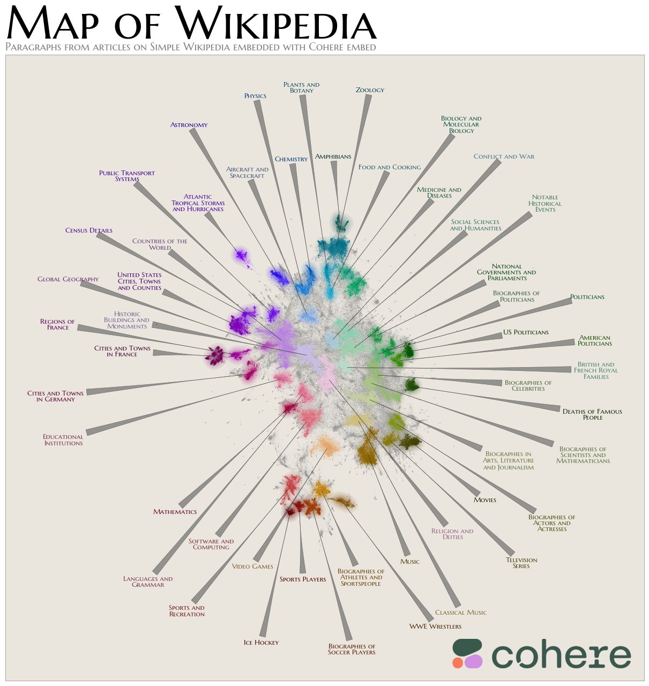

# Summary

Vector embeddings of large corpora of documents, images, videos etc. are becoming
increasingly common. Data maps, produced via tools such as `UMAP` [@umap], provide
visualizable representations these embedded corpora. These techniques are common in
topic modelling and related fields. `DataMapPlot` provides tools to turn these 
visualizable representations into publication ready plots of data maps.

![A data map plot of the CORD-19 dataset [@cord19].\label{fig:cord19}](examples/plot_cord19.png){ width=30% }
{ width=30% }
{ width=30% }

# Statement of need

`DataMapPlot` is a Python package for rendering static plots of labelled data maps.
By leveraging powerful libraries such as `Matplotlib` [@matplotlib] and `Datashader`
[@datashader] we can render high quality publication ready plots. In contrast
to these general purpose libraries however, the narrow focus on data maps allows 
a simple API that can resolve many of the complicated, and hard to get right, 
subtleties of generating plots of data maps. This includes dealing with 
over-plotting, handling label layout, suitable colour palette choices, and more.

`DataMapPlot` is built to be a stand-alone tool that can integrate with all kinds
of other existing tools for generating data maps. That includes popular topic modelling
software such as `BERTopic` [@bertopic], interactive exploration tools such as 
`ThisNotThat` [@thisnotthat], and more.

# Acknowledgements

We acknowledge inspiration from the works of Max Noichl and David McClure among others.

# References